# KA SaaS Engineering Hub

**2026 · Private source · AI-native engineering platform**

KA SaaS Engineering Hub is a private engineering control plane and workspace factory designed to make AI-assisted software development more controlled, verifiable, and secure.

The source repository remains private. This page intentionally documents only the product concept, engineering boundaries, and high-level architecture.

---

## Why I built it

AI coding agents can accelerate implementation, but they also create a new engineering problem: how do you control what an agent is allowed to touch, prove which source state it worked from, separate trusted project metadata from generated product code, and avoid representing missing security evidence as success?

KA Hub explores that problem as an engineering system rather than as a prompt layer.

It is not intended to be an AI app generator. Instead, it prepares and protects the engineering environment in which tools such as Codex or Antigravity can work.

---

## High-level architecture

```mermaid
flowchart LR
    A[Owner / Engineer] --> B[KA Hub Control Plane]
    B --> C[Trusted Workspace Factory]
    C --> D[Project Identity + Policy + Trust Metadata]
    D --> E[Agent Handoff]
    E --> F[Scoped Agent Session]
    F --> G[Agent Gateway / MCP Boundary]
    G --> H[Codex / Antigravity / External IDE]
    H --> I[Source Changes]
    I --> J[Verification + Release Evidence]
    J --> K[Security Sweep + Drift Checks]
    K --> B
```

The central design idea is that prompts are not treated as an authorization boundary. Agent access is mediated by explicit project identity, policy, source state, and scoped sessions.

---

## What the system currently covers

### Trusted workspace creation

A project factory creates a neutral application workspace and assigns a permanent project identity. The workspace receives engineering metadata for architecture, policy, security, deployment, database expectations, and agent instructions.

The creation flow also computes integrity evidence for the workspace and records project state in a registry before the workspace is treated as ready for later provisioning.

### Deployment profiles

The system separates application capabilities from infrastructure profile. Workspaces can be prepared for local development, personal/shared infrastructure, production-oriented environments, or explicitly client-owned infrastructure.

Profile changes keep the project identity stable while requiring infrastructure evidence to be revalidated where necessary.

### Source-bound agent handoff

Agent handoffs are short-lived and one-time. They are issued only after project and source checks and create a separate agent session with explicit scopes.

The session is associated with the intended project, policy state, source commit, expiration, and agent identity instead of granting a general-purpose credential.

### Agent Gateway

The Agent Gateway acts as the enforcement boundary between an AI agent and the engineering workspace.

It validates session permissions, project binding, policy state, source access, and action scope before allowing supported operations such as reading or writing source, creating branches, or pushing verified changes.

Sensitive runtime areas and protected engineering files are restricted. Higher-risk actions are represented as approval requests rather than being silently executed.

### Evidence-driven infrastructure

Provisioning is designed around provider evidence instead of optimistic configuration state.

The system can reason about repository state and infrastructure adapters, and distinguishes between configured, verified, incomplete, unsupported, and failed states rather than converting every provider response into success.

### Release trust

Production-oriented flows bind release approval to a specific source state and verification evidence. A source change after approval invalidates that relationship and requires a new verification cycle.

### Continuous security

The security layer combines deterministic checks, secret-scanning/tool evidence, and signed drift baselines.

A key rule is fail-closed evidence handling: if a required scanner, baseline, provider check, or trust signal is missing, the system reports an incomplete state instead of claiming the project is clean.

---

## Engineering principles behind the project

- **Identity before automation** — every managed workspace has a stable project identity.
- **Policy before agent access** — an agent session is constrained by explicit scopes and current policy state.
- **Evidence before trust** — configuration alone is not treated as proof that infrastructure or security is healthy.
- **Source binding** — handoff, verification, and release decisions are tied to a concrete source state.
- **Fail closed** — missing or unverifiable evidence does not become a false success.
- **Separation of control plane and product code** — generated application workspaces do not inherit the control plane itself.
- **Human approval for dangerous actions** — high-risk operations are not automatically performed just because an agent requested them.

---

## Engineering areas

**Core:** Node.js · Git · JSON-based policy/contracts · cryptographic signing · project registries

**Agent engineering:** MCP · JSON-RPC · scoped sessions · permission enforcement · AI coding-agent handoff

**Security:** secret scanning · integrity digests · signed drift baselines · release evidence · fail-closed verification

**Infrastructure:** repository verification · database/storage/deployment provider adapters · environment profiles

**UI / operator tooling:** web-based control-plane and project evidence views

---

## What is intentionally not public

The following remain in the private source repository:

- implementation source code;
- internal schemas and policy details;
- provider-specific operational logic;
- security-sensitive path and enforcement details;
- runtime configuration;
- credentials, tokens, and infrastructure identifiers;
- internal test fixtures and attack/abuse cases.

Keeping these private allows the project to be presented as engineering work without publishing the implementation that gives the system its value.

---

## Current status

**Active private development.**

The repository contains a substantial automated test suite covering trust, project registry behavior, provisioning logic, agent handoff, gateway behavior, security verification, release trust, runtime contracts, and local end-to-end flows.

The project is being used as a portfolio example of how I approach AI-native software engineering: combining system design, automated implementation workflows, verification, security boundaries, and explicit evidence rather than relying only on generated code.

---

[← Back to Karam Alawaj's GitHub profile](../README.md)
